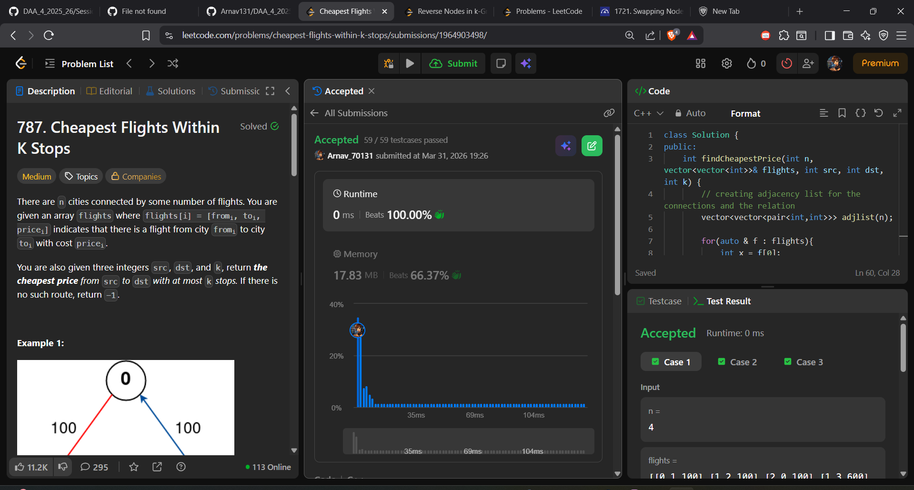

# EXPERIMENT 7

## Arnav Prajapati
## 24BAI70131

## LEETCODE(787): Cheapest Flights Within K Stops

##  Problem Statement
Given n cities and flights [from, to, price], find cheapest price from src to dst with at most k stops.

---

##  Approach
We use BFS with:
- Stop control (levels)
- Cost tracking

---

##  Algorithm
1. Create an adjacency list from the flights data
2. Initialize a cost array with ∞ for all nodes
3. Set cost[src] = 0
4. Use a queue to store (stops, node, current_cost)
5. Start BFS traversal:
6. If (stops exceed k):
    skip
7. For each neighbor:
    If new cost is smaller → update and push into queue
8. At the end:
   If cost[dst] == ∞ → return -1
   Else -> return cost[dst]

---

##  Pseudocode
```
function findCheapestPrice(n, flights, src, dst, k):
    build graph
    cost[src] = 0
    push (0, src, 0)

    while queue not empty:
        stops, node, curr_cost

        if stops > k: continue

        for neighbors:
            if new cost < old:
                update
                push

    return answer
```

---


---

##  Time Complexity
O(E)

##  Space Complexity
O(V + E)

---

## Output.

